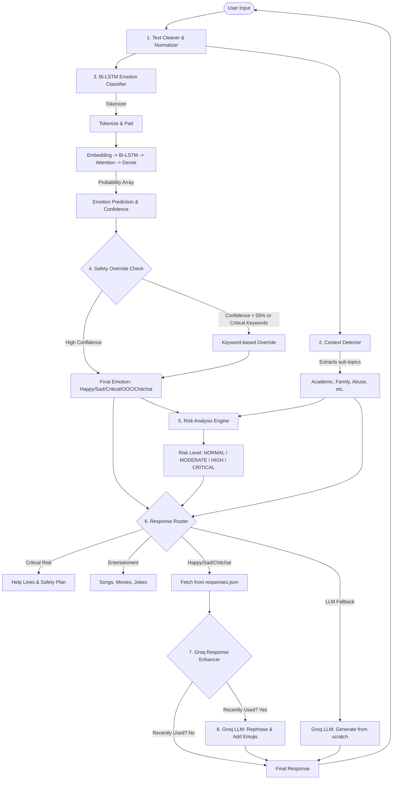
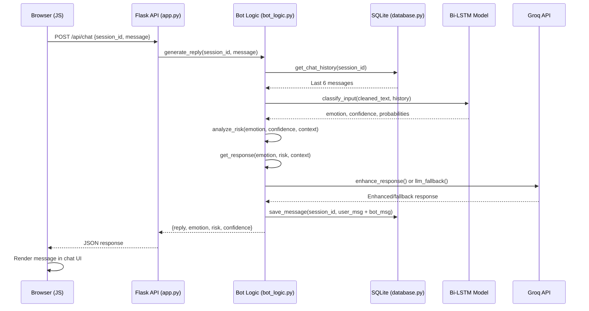

# 🧠 MindMate AI — Full Architecture & Evolution

This document explains the complete internal workings of MindMate AI, how the components interact, the role of the Groq API, and the journey of how the model evolved from V1 to V4.

---

## 🏗️ 1. Complete System Architecture

MindMate V4 is a hybrid AI system. It combines a **Custom Deep Learning Model (Bi-LSTM)** for fast, safe emotion classification with a **Large Language Model (Groq Llama 3.3)** for dynamic, human-like responses.

### 📊 Architecture Diagram



---

## 🔍 2. How the Pipeline Works (Step-by-Step)

When a user types a message (e.g., *"bro kal exam hai aur main fail ho jaunga, bohot darr lag raha hai"*):

1. **Text Cleaning (`clean_text`)**
   - Normalizes Hinglish and Gen-Z slang (e.g., "darr lag raha hai" → "anxious").
   - This prevents the model from getting confused by typos.

2. **Context Detection (`detect_context`)**
   - Identifies the specific sub-topic (e.g., "exam", "fail" → **Academic**).
   - This allows the bot to give specific advice (Study Tips) later.

3. **Emotion Classification (`classify_input`)**
   - The text is tokenized (converted to numbers) and padded.
   - It passes through the **Bi-LSTM** (which reads text forwards and backwards to understand context).
   - The **Attention Layer** weighs the most important words (treating "fail" and "darr" as highly important).
   - Output: `Sad` (Confidence: 85%).

4. **Safety Override Check**
   - If the model's confidence was low, or if a critical keyword was detected, the keyword safety system overrides the AI to ensure a safe response.

5. **Risk Analysis (`analyze_risk`)**
   - Combines the Emotion + Confidence + Context to output a Risk Level.
   - Example rule: If emotion is `Sad` and confidence > 80%, Risk = **MODERATE**.

6. **Response Generation (`get_response`)**
   - The router looks at the `responses.json` database.
   - It fetches a generic validation for Sadness + Academic Advice.

7. **The Groq Enhancer (The "Magic" Step)**
   - To prevent the bot from sounding robotic, it checks if it has used this exact response recently.
   - If yes, it sends the static response to **Groq**.
   - Groq rephrases it instantly into a new, unique Hinglish sentence with emojis.

---

## 🔑 3. How the Groq API Fits In

The Groq API (using the extremely fast Llama 3.3 70B model) serves two distinct purposes in the architecture:

### A. The Response Enhancer (Variety Generator)

In older versions, if a user said "im sad" three times, the bot would pick from a small list of 10 static responses. Eventually, it would repeat itself exactly: *"Main samajh sakta hu... Yeh feelings valid hain."*

With Groq integrated:

- We track the last 15 responses.
- If the bot is about to send a repeated response, it pauses.
- It sends this prompt to Groq: *"Rephrase this mental health message: 'Main samajh sakta hu...' Context: User is sad about exams."*
- Groq returns: *"Bro, exam ka stress real hai, I totally get it. Tu akela nahi hai is tension mein! 📚💙"*
- **Result:** The bot never repeats itself, feels highly dynamic, but remains 100% safe because the *core meaning* was pre-approved in the JSON file.

### B. The Smart Fallback

If the user asks something completely bizarre that the Bi-LSTM and keyword overrides can't classify, the system routes the entire conversation history to Groq. Groq acts as a safety net, generating a contextual Hinglish response on the fly while adhering to strict safety rules.

---

## 📈 4. The Evolution: V0 to V4

The journey of MindMate from a basic script to a complex AI system:

### 🐣 Version 1: The Basic Classifier

**The Problem:** We needed a bot that understood Hinglish mental health queries.
**The Solution:**

- A simple Neural Network (Dense layers only) trained on 2,000 sentences.
- Categories: Happy, Sad, Critical.
- **Flaws:** It looked for exact word matches. If a user typoed "suicid", the bot didn't recognize it. It had zero memory and robotic responses.

### 🐥 Version 2: The Attention Model

**The Problem:** V1 couldn't understand sentence structure. "I am not happy" was classified as "Happy" because "not" was ignored.
**The Solution:**

- Upgraded the architecture to a **Bidirectional LSTM (Bi-LSTM)**. LSTMs remember sequences.
- Added a custom **Attention Layer** so the model learns which words matter most.
- Added a 4th class: `Out_Of_Context`.
- **Flaws:** It was rigid. A smart user could break the classification by using obscure slang.

### 🦅 Version 3: Safety & Memory

**The Problem:** The AI sometimes misclassified critical distress as "sad" or "OOC". In mental health, false negatives are dangerous.
**The Solution:**

- Injected 500+ real-world failure cases into the training data.
- Built a **Keyword Safety Override** system: If the AI is unsure (< 55% confident), hardcoded dictionaries catch dangerous words and force a `Critical` state.
- Added **Conversational Memory**: The bot now remembers the last 5 messages, allowing for multi-turn conversations.
- Connected the Gemini API as a slow, last-resort fallback.

### 🐉 Version 4: The Intelligent Communicator (Current)

**The Problem:** The bot was smart but felt repetitive. Gemini API was too slow for real-time chat. The dataset was unbalanced.
**The Solution:**

- Swapped Gemini for **Groq API** (Llama 3.3) — executing in milliseconds.
- Created the **Groq Response Enhancer** to dynamically rewrite JSON responses, giving the bot infinite dialogue variety.
- Expanded the JSON database massively (added topics for procrastination, body image, peer pressure).
- Augmented the dataset to 6,000+ rows utilizing synonym injection to teach the model thousands of new Hinglish combinations.
- Added a 5th class (`Chitchat`) so the bot can handle casual talk ("kya scene hai", "cricket score") without getting confused.

---

### Conclusion

MindMate AI V4 uses Deep Learning for *safe, predictable routing* and Large Language Models for *dynamic, human-like empathy*. This hybrid approach ensures the bot is both clinically safe (no AI hallucinations during a crisis) and conversationally engaging.

---

## ⚖️ 5. Summary: Your Model vs. Your API

Think of it like a restaurant: **Your Model is the Manager (makes the rules and decisions)**, and the **API is the Waiter (delivers the message beautifully).**

### 🧠 What YOUR Model (Bi-LSTM) is doing

Your model is the "Brains and Safety Net". Every time a user types a message, your model does the heavy lifting to figure out *what* the user is feeling.

Because it's a mental health app, we **cannot** rely on an external API to make clinical decisions (APIs hallucinate and make mistakes). Your model is trained specifically on your data to be 100% reliable for routing.

**Your model's job is:**

1. **Classification:** It reads the text and decides: Is this `Happy`, `Sad`, `Critical`, `Out of Context`, or `Chitchat`?
2. **Confidence:** It says, *"I am 85% sure this user is Sad."*
3. **Risk Analysis:** It decides the risk level (Normal, Moderate, Critical) so the system knows if it needs to trigger emergency helplines.
4. **Picking the Advice:** Once it knows the user is "Sad" and talking about "Exams", your system selects the exact, pre-approved advice from your `responses.json` file.

*At this point, your system has decided exactly what needs to be said. But if we stop here, the bot will sound like a robot, repeating the same 5 sentences from the JSON file forever.*

### 🗣️ What the GROQ API (Llama 3.3 70B) is doing

The API is the "Empathy and Context Engine". In V4.3, we upgraded Groq from a simple "rephraser" to a **Full Contextual Response Generator**.

Once your model has decided *what* state the user is in (e.g., Sad, Critical, Chitchat), the API takes over to craft the perfect response:

1. **The Contextual Enhancer (V4.3):**
   If your model decides the user needs validation for being sad, the system doesn't just send a canned response. It sends Groq the **entire recent conversation**, the **emotional trend** (`sad → sad → sad`), and the **specific topic** (e.g., "exams").
   Groq uses the static JSON response *only as a guide* and generates a **completely new, deeply personal response from scratch** that references the user's specific words.
   *Example:* If user says "exam fail ho gaya", Groq responds with "Exam ka result tujhe hurt kar raha hai na..." instead of a generic "Sab theek ho jayega."

2. **The Smart Fallback & Emotion Momentum:**
   If the conversation takes an ambiguous turn (e.g., user says "hmm"), the system uses its **Emotion Momentum Guard** to look at the last 3-5 emotions. It passes this history to Groq, which intelligently maintains the emotional context rather than giving a disjointed, "out of context" reply.

### 💡 Why this Hybrid Approach is the BEST way

If you *only* used your model, the bot would be safe but boring and robotic.
If you *only* used an API (like ChatGPT), it might accidentally give dangerous advice to a suicidal user because LLMs are unpredictable.

By combining them:

- **Your Model** guarantees clinical **safety and accuracy**.
- **Your API key** guarantees **engaging, varied, human-like conversation**.

---

## 🌐 6. Web Application Architecture (Full-Stack)

MindMate V4 is now a full-stack web application accessible via any browser.

### Tech Stack

| Layer | Technology | Purpose |
|-------|-----------|---------|
| **Frontend** | HTML + CSS + Vanilla JS | Premium glassmorphism dark UI with animated neon orbs |
| **Backend** | Flask (Python) | REST API serving `/api/chat`, `/api/session`, `/api/history` |
| **Database** | SQLite (`mindmate.db`) | Stores users, sessions, and full chat history |
| **ML Engine** | TensorFlow/Keras | Bi-LSTM + Attention model for emotion classification |
| **LLM** | Groq API (Llama 3.3 70B) | Response enhancement & smart fallback |

### Request Flow



### Key Design Decisions

- **Session-based state:** Each browser tab gets a unique `session_id` stored in `localStorage`. Server-side, `bot_logic.py` uses `defaultdict` to maintain per-session state (context, risk trend, entertainment flow).
- **CORS enabled:** `flask-cors` allows the API to be accessed from any origin.
- **Graceful fallback:** If Groq API is unavailable, the bot still functions using static responses from `responses.json`.

---

## 🛡️ 7. V4.1 Negation Guard (Classification Safety)

A critical fix added in V4.1 to solve the "not feeling good → happy" misclassification bug.

### The Problem

The Bi-LSTM model tokenizes text word by word. When a user says "im **not** feeling **good**", the model sees the token "good" and predicts **Happy** with high confidence (~99%). The keyword override system (STEP 1-4) couldn't catch this because:

- STEP 1 checks `emotion not in ["happy"]` — **skipped** because model already predicted happy.
- STEP 3 checks for sad keywords in combined text — but "not feeling good" doesn't exactly match any sad keyword like "not good" (word "feeling" is in between).

### The Fix (Pre-Step Negation Guard)

A new check was added **before** all keyword override steps:

```python
# === NEGATION GUARD (V4.1) ===
negation_words = [r"\bnot\b", r"\bdont\b", r"\bdon't\b", r"\bnahi\b", ...]
has_negation = any(re.search(neg, combined_check) for neg in negation_words)

if emotion == "happy" and has_negation:
    # Check for critical keywords first (safety!)
    if has_critical:
        return "critical", 0.95, probabilities
    return "sad", 0.85, probabilities
```

This ensures that any input where the model predicts "happy" but contains negation words like "not", "dont", "nahi", "never" is automatically overridden to "sad" (or "critical" if crisis keywords are detected).

---

## 🔄 8. V4.2 Critical Risk Loop Fix (Context Isolation)

A major flaw was discovered in how V3 managed conversational memory, leading to an **infinite Critical Risk loop**.

### The Problem
To make the emotion classifier "context-aware," V3 prepended the user's last two messages to their current input before sending it to the Bi-LSTM model. 

* **State 1:** User says "I want to die" → Model detects `die` → Risk = **CRITICAL**.
* **State 2:** User later says "I need a friend".
* **Behind the scenes:** The system passed `"I want to die I need a friend"` to the model.
* **Result:** Because the critical keywords from the previous message were *still present* in the text string being classified, the model repeatedly forced a **CRITICAL** state, trapping the user in an endless loop of emergency responses regardless of what they actually said next. 

### The Fix (Context Decoupling)
In V4.2, **raw history prepending was completely disabled** for the primary classification engine (`classify_input`). 
Instead of merging previous text strings into the current input, the system now relies entirely on discrete state trackers (`bot.session_state["risk_trend"]` and programmatic `detect_context()`) to maintain conversational state seamlessly.

The conversation history is STILL passed to the **Groq LLM Enhancer**, meaning the final textual response feels highly contextual and connected, but the clinical routing block (Bi-LSTM + Risk Engine) now cleanly analyzes *only* the user's immediate input to ensure accurate, unpolluted risk assessment turn-by-turn.

---

## 🤖 9. V4 AI-Enhanced Training Pipeline

### A. AI-Generated Training Data (`generate_ai_data.py`)

Uses the **Groq API (Llama 3.3 70B)** to generate hundreds of diverse training examples per class. The LLM is prompted to create varied Hinglish text including:

- **Misspellings** and informal texting style
- **Negated positive phrases** ("not feeling good", "achha nahi lag raha")
- **Code-switched** Hindi-English combinations
- **Edge cases** that the model currently misclassifies

### B. GloVe Pre-trained Embeddings (`train_model_v4.py`)

Instead of learning word meanings from scratch (random initialization), V4 can optionally load **GloVe 100d** pre-trained word vectors. This means the model starts training already "knowing" that:

- "sad" and "depressed" are related
- "happy" and "joyful" are similar
- "not" is a negation that changes meaning

This dramatically reduces training time and improves accuracy, especially on unseen vocabulary.

### Training Workflow & Continuous Learning Loop

Generating new data is only half the process. The AI model **must be retrained** to actually "learn" the new vocabulary and patterns.

**The Continuous Learning Loop:**

1. **Generate Data:** Run `generate_ai_data.py`. This uses Groq to create a new `AI_GENERATED_dataset.csv`.
2. **Download GloVe:** Ensure `glove.6B/glove.6B.100d.txt` is present in the project folder.
3. **Retrain Model:** Run `train_model_v4.py`. The neural network reads the new CSV rows, updates its Tokenizer vocabulary, and adjusts its internal weights via backpropagation.
4. **Deploy:** The script automatically overwrites `mental_health_model.h5`. The next time you start the server (`app.py`), the bot will be instantly smarter.
